# 예외처리
예외가 던져질 경우 일괄적으로 처리된다  
예외로 필터에서는 직접 명시한다
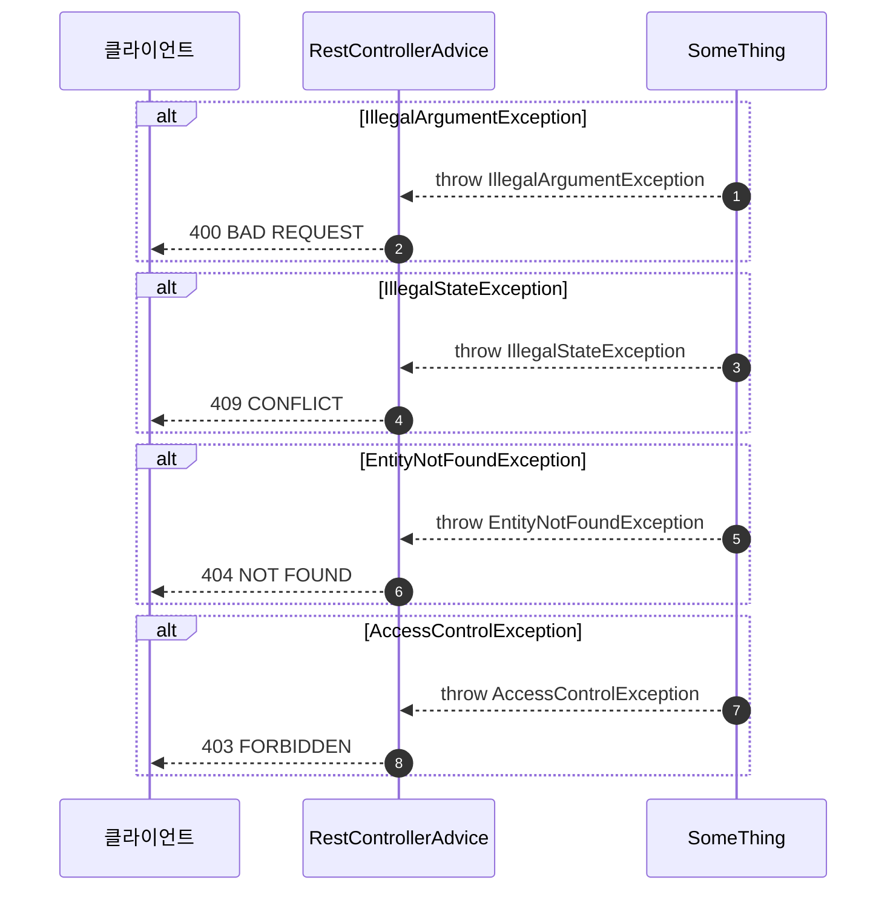

# 인증, 인가
인증은 모든 시퀀스에 포함된다.

## 인증 과정
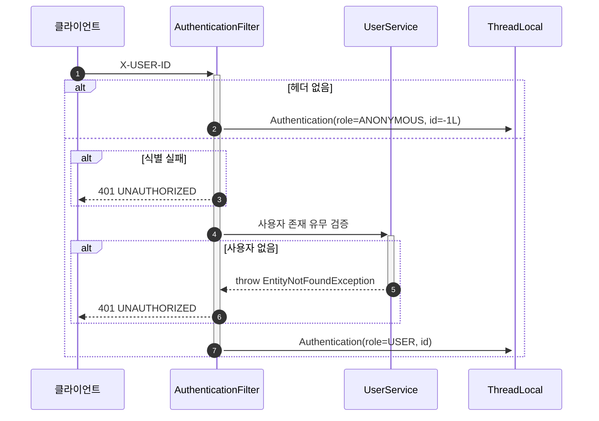

## 인가 과정
모든 사용자라고 명시돼있다면 생략한다.  
****로그인한 사용자****라고 명시돼 있다면 authorize(USER)를 활용한다.  
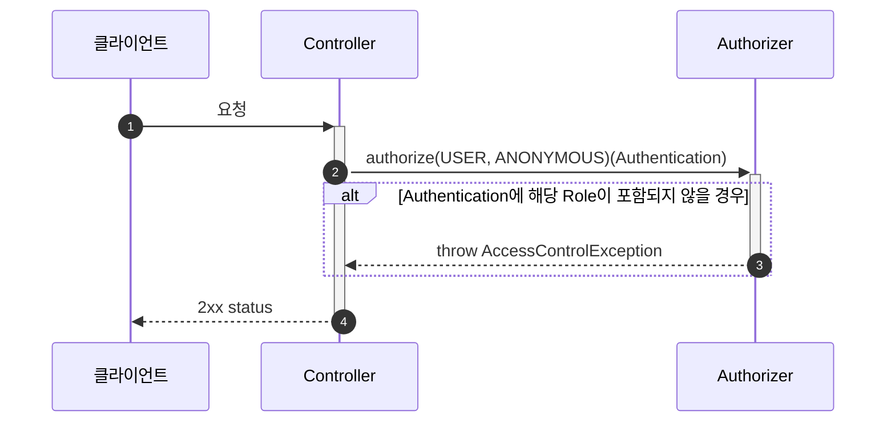
---
# 브랜드

## 브랜드 목록 조회
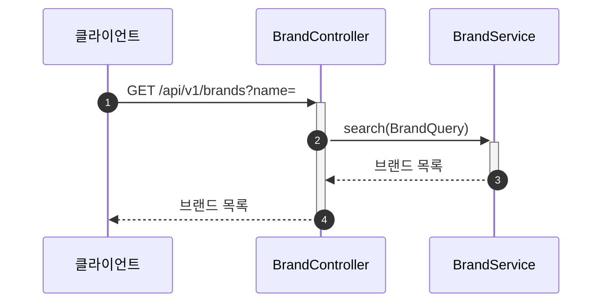

## 브랜드 상세 조회
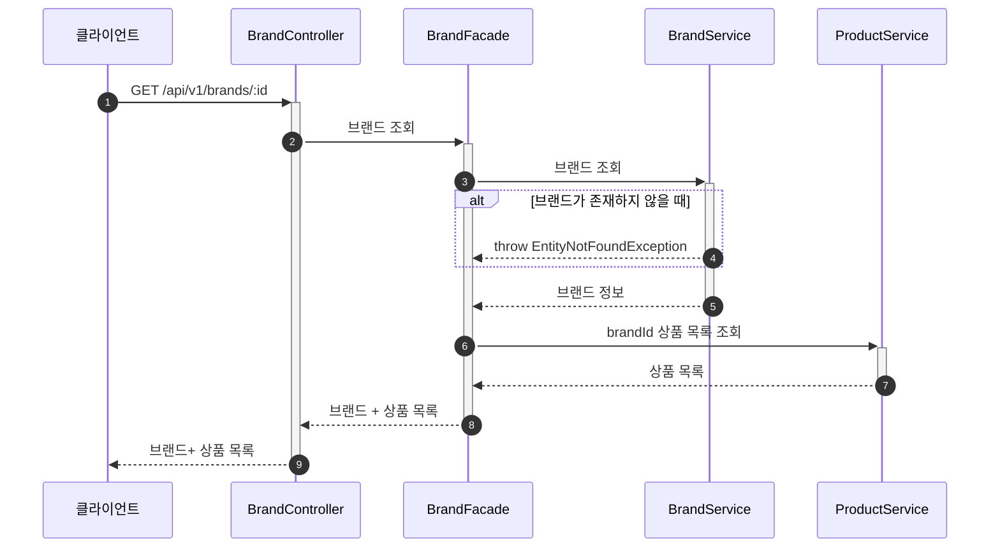

---
# 상품
### 모든 사용자는 전체 상품 목록을 볼 수 있다.
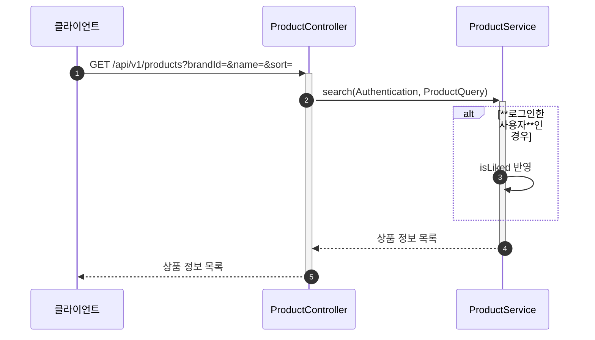

### 모든 사용자는 상품 식별자를 통해 상품 상세 정보를 볼 수 있다.
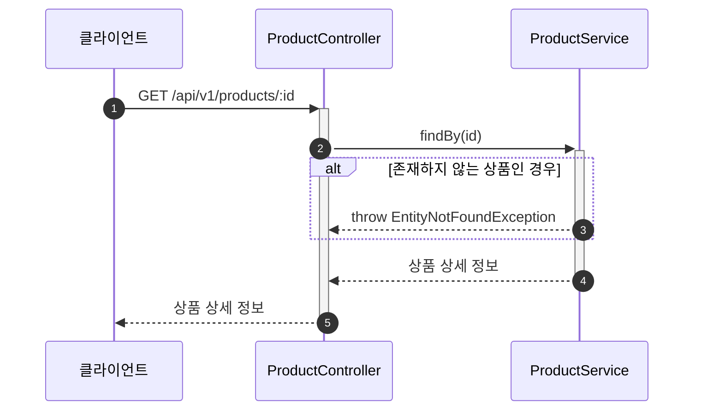

### **로그인한 사용자**는 자신이 좋아요한 상품 목록을 조회할 수 있다.
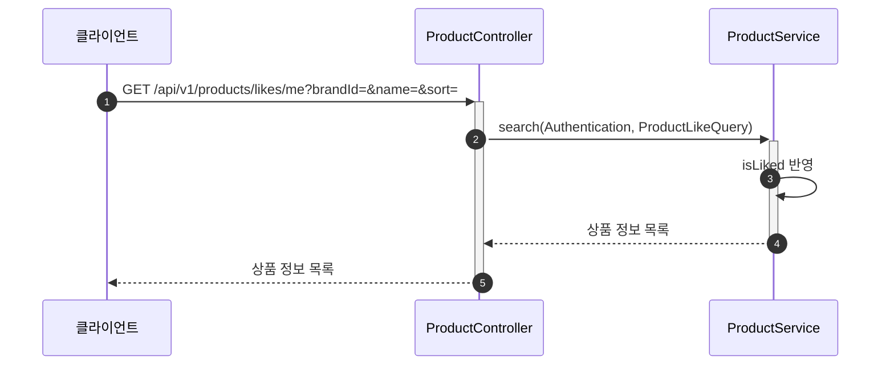

### **로그인한 사용자**는 상품 식별자를 통해 상품에 좋아요를 추가할 수 있다.
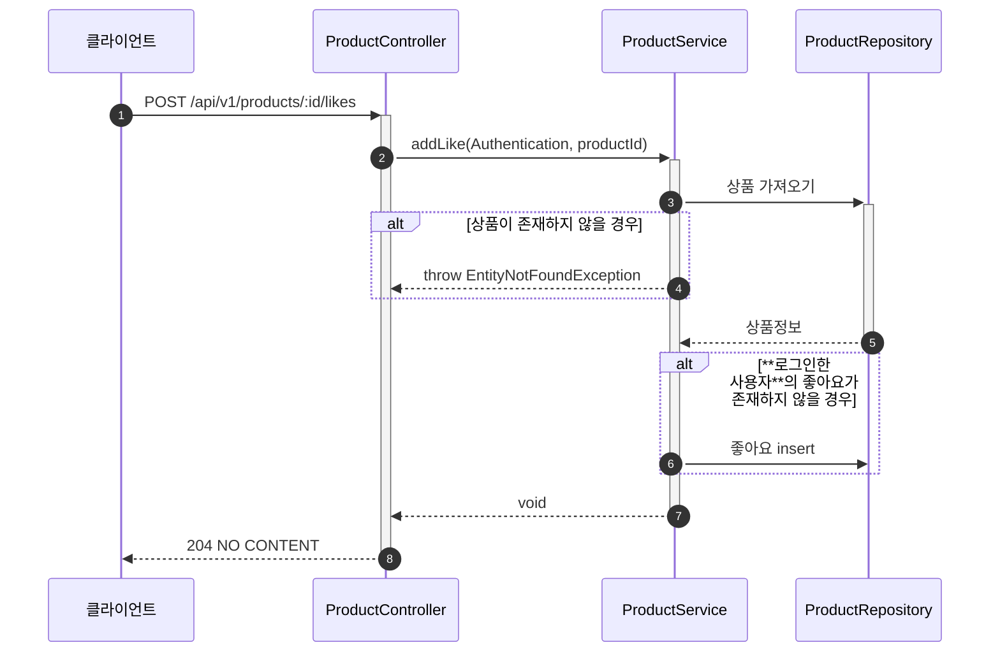

### **로그인한 사용자**는 상품 식별자를 통해 상품에 좋아요를 취소할 수 있다.
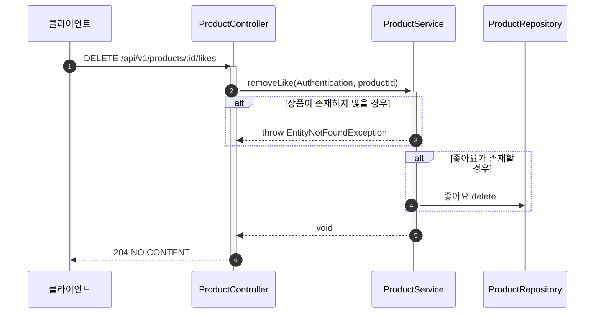

---
# 주문
### **로그인한 사용자**는 SKU 식별자와 수량목록을 입력해 주문을 생성할 수 있다.
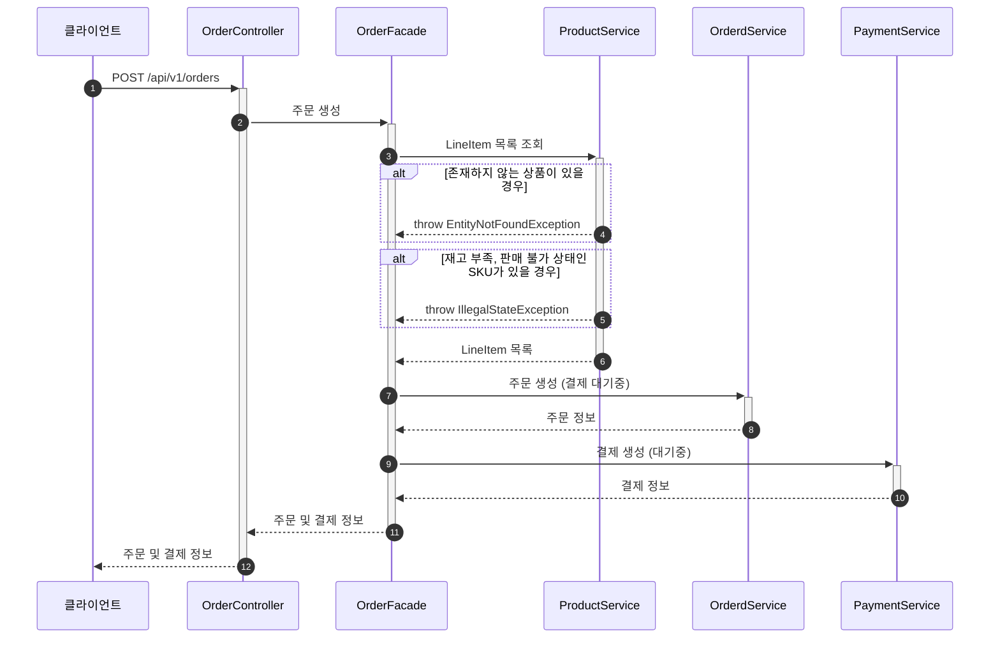

### **로그인한 사용자**는 자신의 주문 목록을 조회할 수 있다.
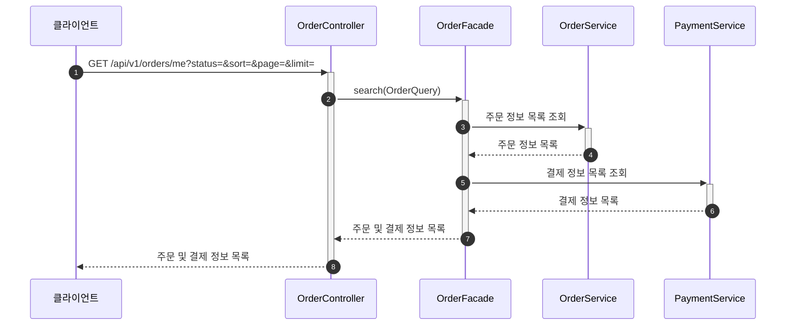

### **로그인한 사용자**는 주문 생성 후 포인트 결제를 진행할 수 있다.
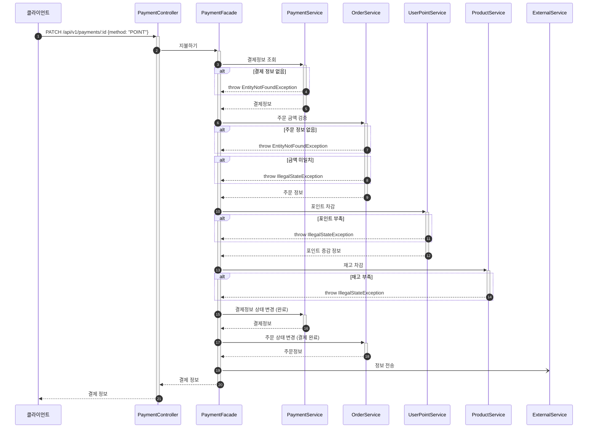