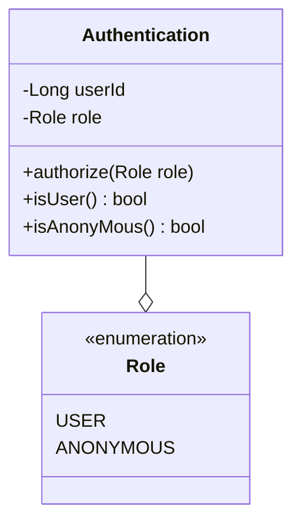
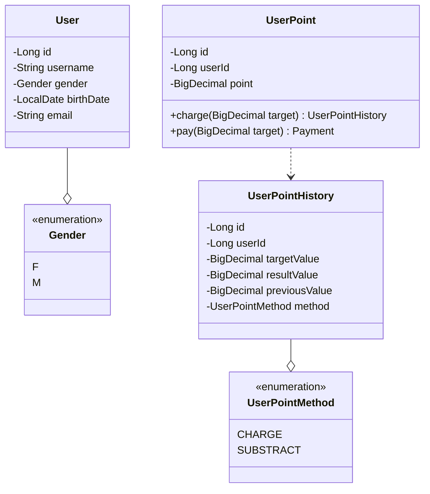
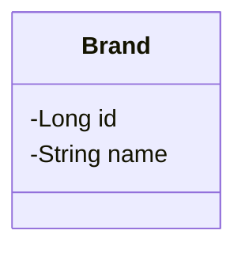
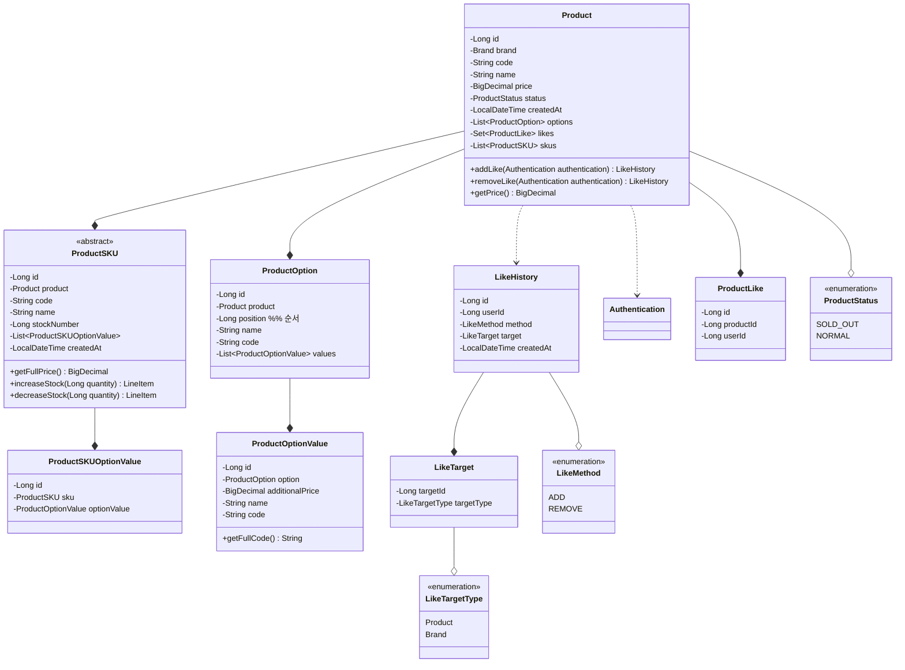
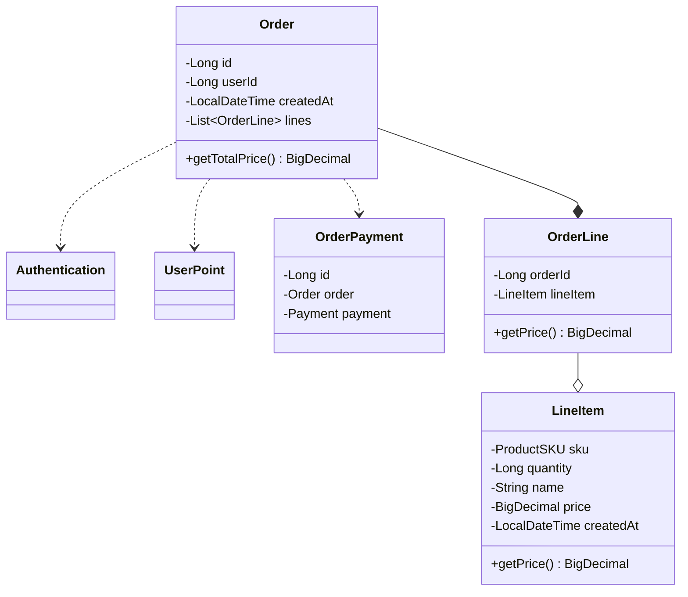
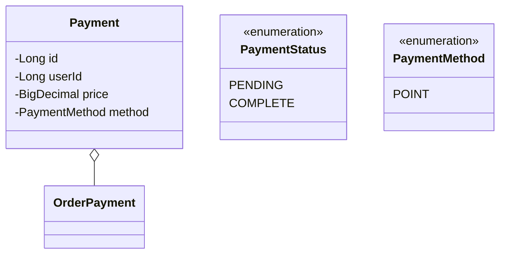

```mermaid
classDiagram
    class Authentication {
        -Long userId
        -Role role
        +authorize(Role role)
        +isUser() bool
        +isAnonyMous() bool
    }
    Authentication --o Role

    class Role {
        <<enumeration>>
        USER
        ANONYMOUS
    }
```

```mermaid
classDiagram
    class User {
        -Long id
        -String username
        -Gender gender
        -LocalDate birthDate
        -String email
    }
    class Gender {
        <<enumeration>>
        F
        M
    }
    class UserPoint {
        -Long id
        -Long userId
        -BigDecimal point
        +charge(BigDecimal target) UserPointHistory
        +pay(BigDecimal target) Payment
    }
    UserPoint ..> UserPointHistory
    
    class UserPointHistory {
        -Long id
        -Long userId
        -BigDecimal targetValue
        -BigDecimal resultValue
        -BigDecimal previousValue
        -UserPointMethod method
    }
    UserPointHistory --o UserPointMethod
    
    class UserPointMethod {
        <<enumeration>>
        CHARGE
        SUBSTRACT
    }
    User --o Gender
```

```mermaid
classDiagram
    class Brand {
        -Long id
        -String name
    }
```

```mermaid
classDiagram
    class Product {
        -Long id
        -Brand brand
        -String code
        -String name
        -BigDecimal price
        -ProductStatus status
        -LocalDateTime createdAt
        -List~ProductOption~ options
        -Set~ProductLike~ likes
        -List~ProductSKU~ skus
        +addLike(Authentication authentication) LikeHistory
        +removeLike(Authentication authentication) LikeHistory
        +getPrice() BigDecimal
    }
    Product --* ProductSKU

    class ProductSKU {
        <<abstract>>
        -Long id
        -Product product
        -String code
        -String name
        -Long stockNumber
        -List~ProductSKUOptionValue~
        -LocalDateTime createdAt
        +getFullPrice() BigDecimal
        +increaseStock(Long quantity) LineItem
        +decreaseStock(Long quantity) LineItem
    }

    ProductSKU --* ProductSKUOptionValue

    class ProductSKUOptionValue {
        -Long id
        -ProductSKU sku
        -ProductOptionValue optionValue
    }

    class ProductOptionValue {
        -Long id
        -ProductOption option
        -BigDecimal additionalPrice
        -String name
        -String code
        +getFullCode() String
    }
    ProductOption --* ProductOptionValue
    class ProductOption {
        -Long id
        -Product product
        -Long position %% 순서
        -String name
        -String code
        -List~ProductOptionValue~ values
    }
    Product ..> LikeHistory
    Product ..> Authentication
    Product --* ProductOption

    class LikeHistory {
        -Long id
        -Long userId
        -LikeMethod method
        -LikeTarget target
        -LocalDateTime createdAt
    }
    LikeHistory --* LikeTarget
    class LikeTarget {
        -Long targetId
        -LikeTargetType targetType
    }
    LikeTarget --o LikeTargetType
    LikeHistory --o LikeMethod
    class LikeTargetType {
        <<enumeration>>
        Product
        Brand
    }

    class LikeMethod {
        <<enumeration>>
        ADD
        REMOVE
    }

    Product --* ProductLike
    Product --o ProductStatus
    class ProductLike {
        -Long id
        -Long productId
        -Long userId
    }

    class ProductStatus {
        <<enumeration>>
        SOLD_OUT
        NORMAL
    }
```

```mermaid
classDiagram
    class Order {
        -Long id
        -Long userId
        -LocalDateTime createdAt
        -List~OrderLine~ lines
        +getTotalPrice() BigDecimal
    }
    Order ..> Authentication
    Order ..> UserPoint
    Order ..> OrderPayment

    Order --* OrderLine
    class OrderLine {
        -Long orderId
        -LineItem lineItem
        +getPrice() BigDecimal
    }

    OrderLine --o LineItem


    class LineItem {
        -ProductSKU sku
        -Long quantity
        -String name
        -BigDecimal price
        -LocalDateTime createdAt
        +getPrice() BigDecimal
    }
    class OrderPayment {
        -Long id
        -Order order
        -Payment payment
    }
```
    

```mermaid
classDiagram
    class Payment {
        -Long id
        -Long userId
        -BigDecimal price
        -PaymentMethod method
    }
    class PaymentStatus {
        <<enumeration>>
        PENDING
        COMPLETE
    }
    Payment o-- OrderPayment
    class PaymentMethod {
        <<enumeration>>
        POINT
    }
```