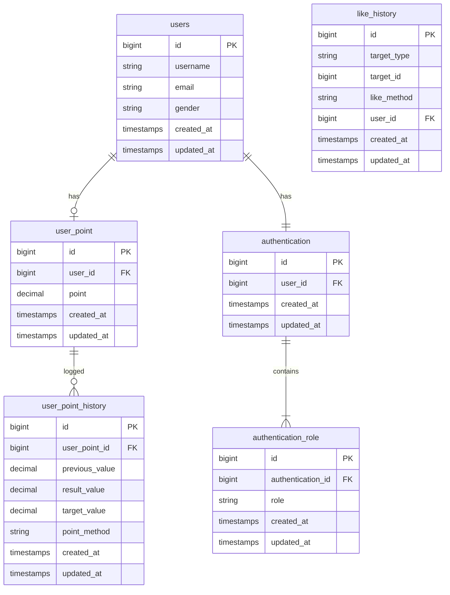
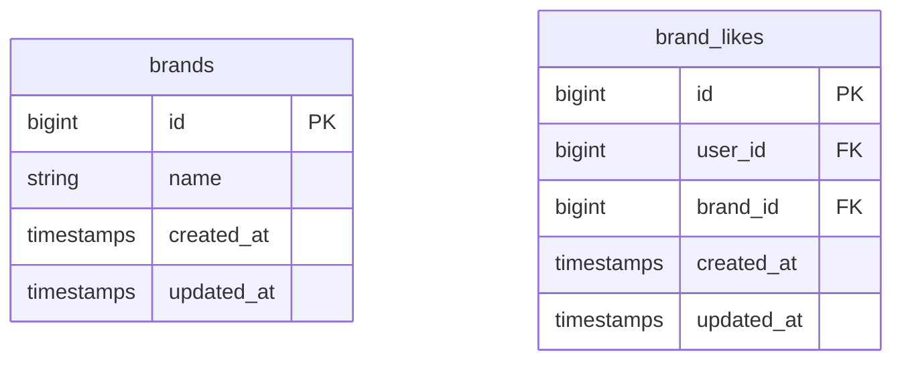
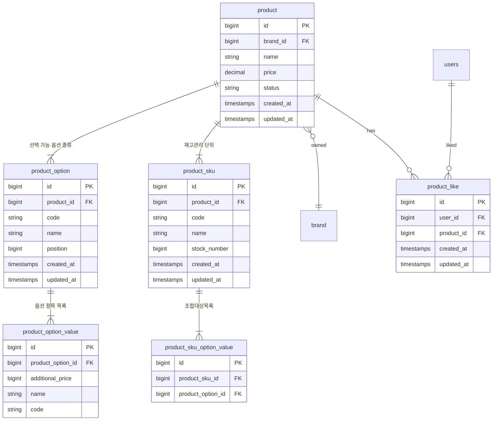
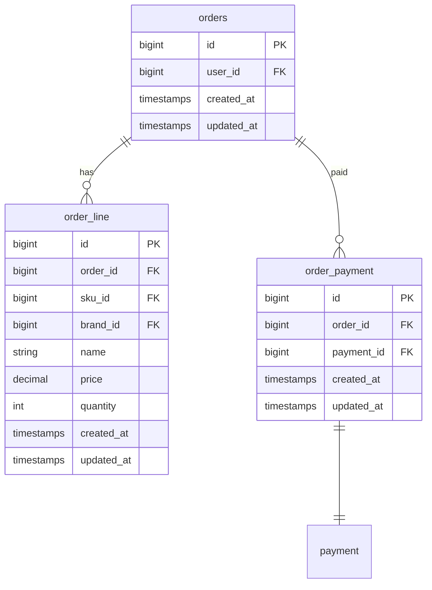
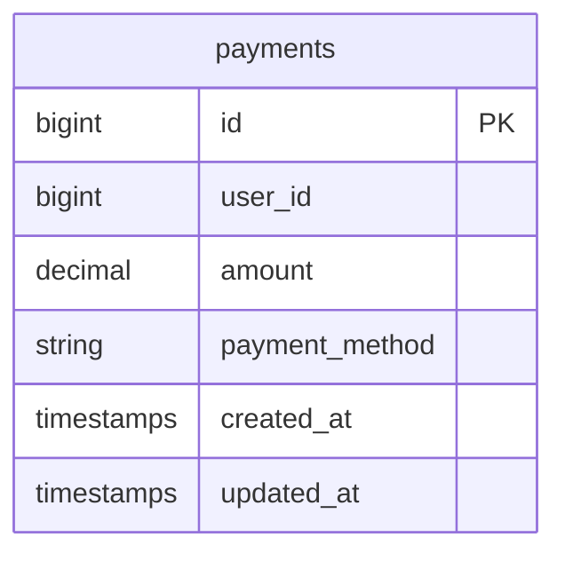
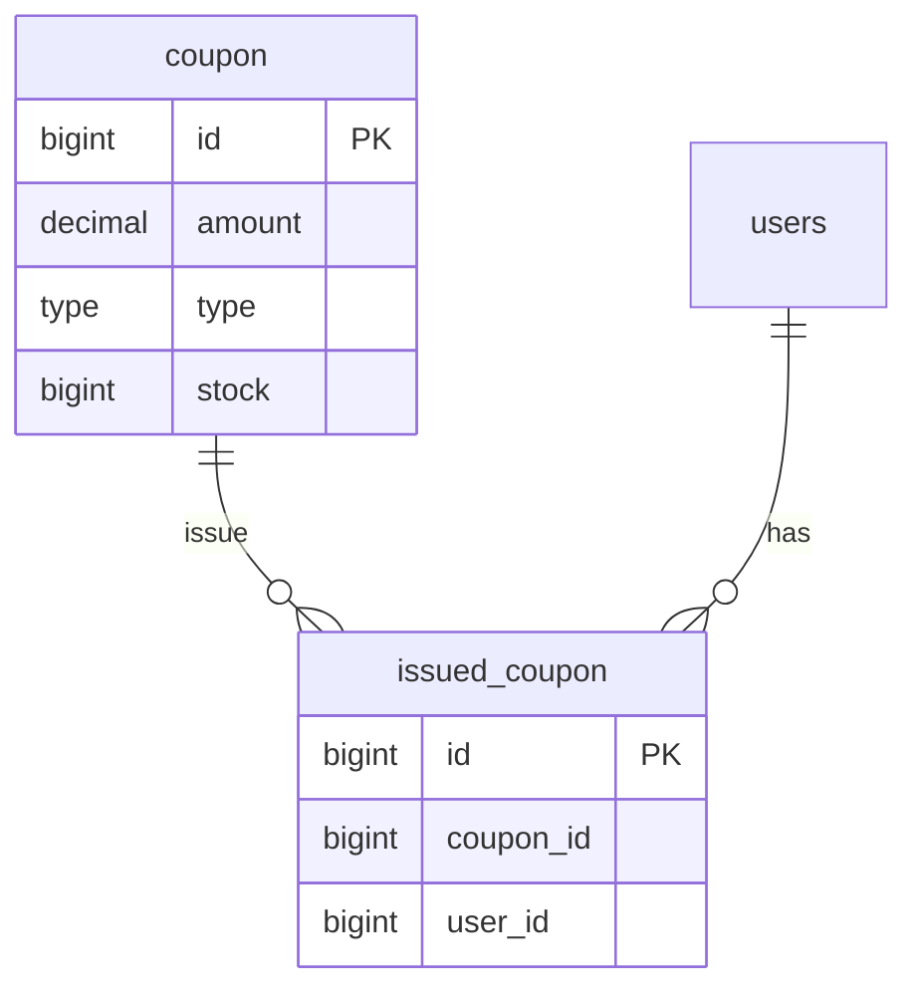

```mermaid
erDiagram
    users {
        bigint id PK
        string username
        string email
        string gender
        timestamps created_at
        timestamps updated_at
    }
    user_point {
        bigint id PK
        bigint user_id FK
        decimal point
        timestamps created_at
        timestamps updated_at
    }
    user_point_history {
        bigint id PK
        bigint user_point_id FK
        decimal previous_value
        decimal result_value
        decimal target_value
        string point_method
        timestamps created_at
        timestamps updated_at
    }
    authentication {
        bigint id PK
        bigint user_id FK
        timestamps created_at
        timestamps updated_at
    }
    authentication_role {
        bigint id PK
        bigint authentication_id FK
        string role
        timestamps created_at
        timestamps updated_at
    }

    like_history {
        bigint id PK
        string target_type
        bigint target_id
        string like_method
        bigint user_id FK
        timestamps created_at
        timestamps updated_at
    }
    users ||--o| user_point : has
    users ||--|| authentication : has
    authentication ||--|{ authentication_role : contains
    user_point ||--o{ user_point_history: logged
```

```mermaid
erDiagram    
    %% 브랜드
    brands {
        bigint id PK
        string name
        timestamps created_at
        timestamps updated_at
    }

    brand_likes {
        bigint id PK
        bigint user_id FK
        bigint brand_id FK
        timestamps created_at
        timestamps updated_at
    }
```

```mermaid
erDiagram        
    
    %% 상품
    product {
        bigint id PK
        bigint brand_id FK
        string name
        decimal price
        string status
        timestamps created_at
        timestamps updated_at
    }
    
    product_sku {
        bigint id PK
        bigint product_id FK
        string code
        string name
        bigint stock_number
        timestamps created_at
        timestamps updated_at
    }
    
    product_sku_option_value {
        bigint id PK
        bigint product_sku_id FK
        bigint product_option_id FK
    }
    
    product_option {
        bigint id PK
        bigint product_id FK
        string code
        string name
        bigint position
        timestamps created_at
        timestamps updated_at
    }
    
    product_option_value {
        bigint id PK
        bigint product_option_id FK
        bigint additional_price
        string name
        string code
    }
    
    product_like {
        bigint id PK
        bigint user_id FK
        bigint product_id FK
        timestamps created_at
        timestamps updated_at
    }


    users ||--o{ product_like: liked
    product ||--o{ product_like: has
    product }o--|| brand: owned
    product ||--|{ product_sku: "재고관리 단위"
    product_sku ||--|{ product_sku_option_value: "조합대상목록"
    product ||--|{ product_option: "선택 가능 옵션 종류"
    product_option ||--|{ product_option_value: "옵션 항목 목록"
```

```mermaid
erDiagram    
    %% 주문
    orders {
        bigint id PK
        bigint user_id FK
        timestamps created_at
        timestamps updated_at
    }
    order_line {
        bigint id PK
        bigint order_id FK
        bigint sku_id FK
        bigint brand_id FK
        string name
        decimal price
        int quantity
        timestamps created_at
        timestamps updated_at
    }
    order_payment {
        bigint id PK
        bigint order_id FK
        bigint payment_id FK
        timestamps created_at
        timestamps updated_at
    }
    orders ||--o{ order_line: has
    orders ||--o{ order_payment: paid
    order_payment ||--|| payment: ""
```

```mermaid
erDiagram    
    %% 결제
    payments {
        bigint id PK
        bigint user_id
        decimal amount
        string payment_method
        timestamps created_at
        timestamps updated_at
    }

```

```mermaid
erDiagram
    %% 쿠폰
    coupon {
        bigint id PK
        decimal amount
        type type
        bigint stock
    }
    
    issued_coupon {
        bigint id PK
        bigint coupon_id
        bigint user_id
    }

    coupon ||--o{issued_coupon: issue
    users ||--o{issued_coupon:has
```