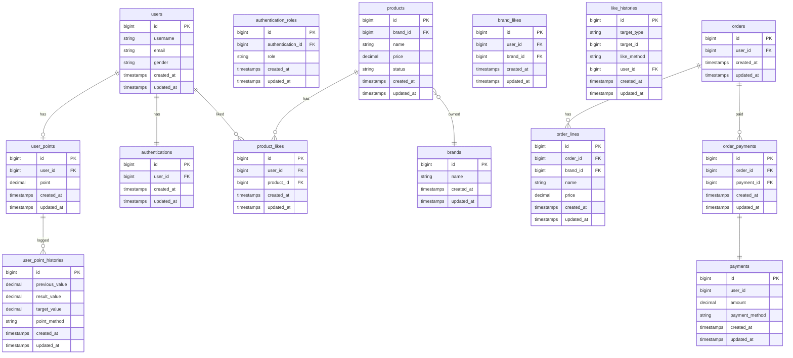

```mermaid
erDiagram
    users {
        bigint id PK
        string username
        string email
        string gender
        timestamps created_at
        timestamps updated_at
    }
    user_points {
        bigint id PK
        bigint user_id FK
        decimal point
        timestamps created_at
        timestamps updated_at
    }
    user_point_histories {
        bigint id PK
        decimal previous_value
        decimal result_value
        decimal target_value
        string point_method
        timestamps created_at
        timestamps updated_at
    }
    authentications {
        bigint id PK
        bigint user_id FK
        timestamps created_at
        timestamps updated_at
    }
    authentication_roles {
        bigint id PK
        bigint authentication_id FK
        string role
        timestamps created_at
        timestamps updated_at
    }
    brands {
        bigint id PK
        string name
        timestamps created_at
        timestamps updated_at
    }
    products {
        bigint id PK
        bigint brand_id FK
        string name
        decimal price
        string status
        timestamps created_at
        timestamps updated_at
    }
    product_likes {
        bigint id PK
        bigint user_id FK
        bigint product_id FK
        timestamps created_at
        timestamps updated_at
    }
    brand_likes {
        bigint id PK
        bigint user_id FK
        bigint brand_id FK
        timestamps created_at
        timestamps updated_at
    }
    like_histories {
        bigint id PK
        string target_type
        bigint target_id
        string like_method
        bigint user_id FK
        timestamps created_at
        timestamps updated_at
    }
    orders {
        bigint id PK
        bigint user_id FK
        timestamps created_at
        timestamps updated_at
    }
    order_lines {
        bigint id PK
        bigint order_id FK
        bigint brand_id FK
        string name
        decimal price
        timestamps created_at
        timestamps updated_at
    }
    order_payments {
        bigint id PK
        bigint order_id FK
        bigint payment_id FK
        timestamps created_at
        timestamps updated_at
    }
    payments {
        bigint id PK
        bigint user_id
        decimal amount
        string payment_method
        timestamps created_at
        timestamps updated_at
    }
    users ||--o| user_points : has
    users ||--|| authentications : has
    users ||--o{ product_likes: liked
    products ||--o{ product_likes: has
    products }o--|| brands: owned
    user_points ||--o{ user_point_histories: logged
    orders ||--o{ order_lines: has
    orders ||--o{ order_payments: paid
    order_payments ||--|| payments: ""
```