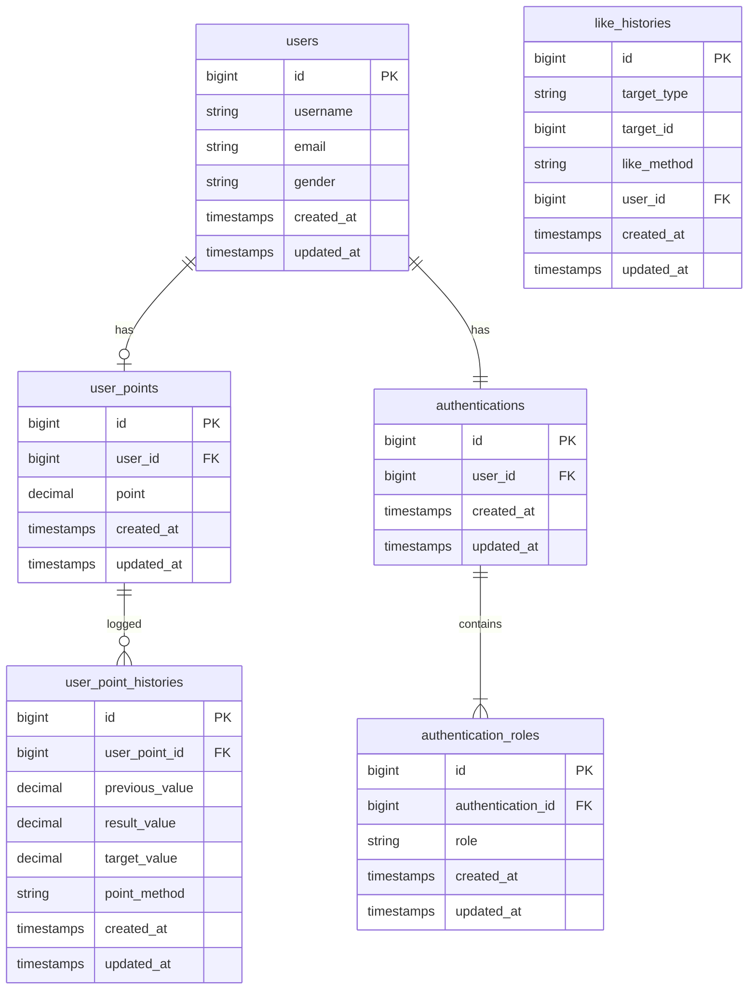
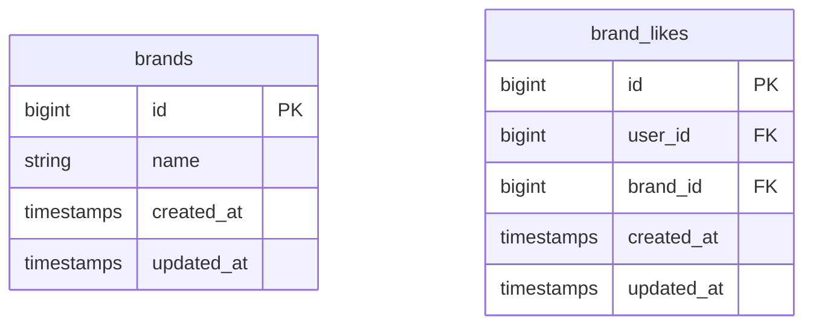
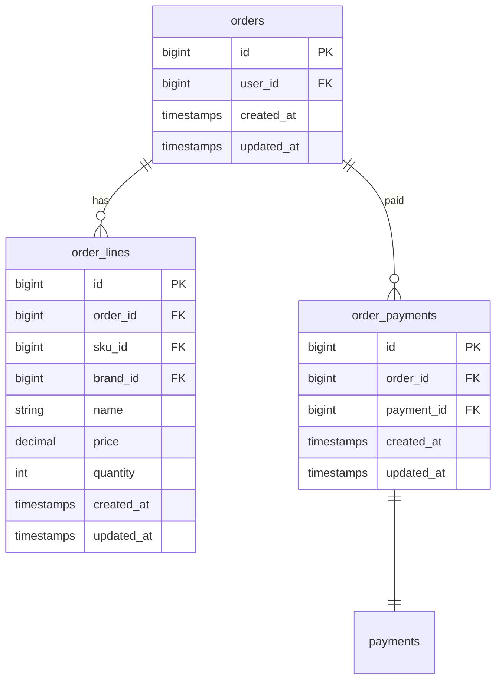
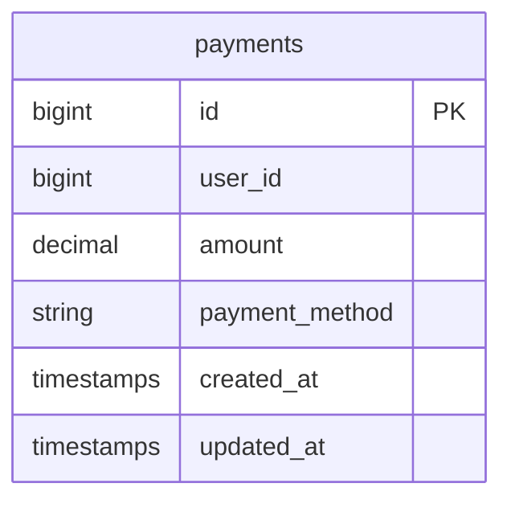

```mermaid
erDiagram
    users {
        bigint id PK
        string username
        string email
        string gender
        timestamps created_at
        timestamps updated_at
    }
    user_points {
        bigint id PK
        bigint user_id FK
        decimal point
        timestamps created_at
        timestamps updated_at
    }
    user_point_histories {
        bigint id PK
        bigint user_point_id FK
        decimal previous_value
        decimal result_value
        decimal target_value
        string point_method
        timestamps created_at
        timestamps updated_at
    }
    authentications {
        bigint id PK
        bigint user_id FK
        timestamps created_at
        timestamps updated_at
    }
    authentication_roles {
        bigint id PK
        bigint authentication_id FK
        string role
        timestamps created_at
        timestamps updated_at
    }

    like_histories {
        bigint id PK
        string target_type
        bigint target_id
        string like_method
        bigint user_id FK
        timestamps created_at
        timestamps updated_at
    }
    users ||--o| user_points : has
    users ||--|| authentications : has
    authentications ||--|{ authentication_roles : contains
    user_points ||--o{ user_point_histories: logged
```

```mermaid
erDiagram    
    %% 브랜드
    brands {
        bigint id PK
        string name
        timestamps created_at
        timestamps updated_at
    }

    brand_likes {
        bigint id PK
        bigint user_id FK
        bigint brand_id FK
        timestamps created_at
        timestamps updated_at
    }
```

```mermaid
erDiagram        
    
    %% 상품
    products {
        bigint id PK
        bigint brand_id FK
        string name
        decimal price
        string status
        timestamps created_at
        timestamps updated_at
    }
    
    product_skus {
        bigint id PK
        bigint product_id FK
        string code
        string name
        bigint stock_number
        timestamps created_at
        timestamps updated_at
    }
    
    product_sku_option_values {
        bigint id PK
        bigint product_sku_id FK
        bigint product_option_id FK
    }
    
    product_options {
        bigint id PK
        bigint product_id FK
        string code
        string name
        bigint position
        timestamps created_at
        timestamps updated_at
    }
    
    product_option_values {
        bigint id PK
        bigint product_option_id FK
        bigint additional_price
        string name
        string code
    }
    
    product_likes {
        bigint id PK
        bigint user_id FK
        bigint product_id FK
        timestamps created_at
        timestamps updated_at
    }


    users ||--o{ product_likes: liked
    products ||--o{ product_likes: has
    products }o--|| brands: owned
    products ||--|{ product_skus: "재고관리 단위"
    product_skus ||--|{ product_sku_option_values: "조합대상목록"
    products ||--|{ product_options: "선택 가능 옵션 종류"
    product_options ||--|{ product_option_values: "옵션 항목 목록"
```

```mermaid
erDiagram    
    %% 주문
    orders {
        bigint id PK
        bigint user_id FK
        timestamps created_at
        timestamps updated_at
    }
    order_lines {
        bigint id PK
        bigint order_id FK
        bigint sku_id FK
        bigint brand_id FK
        string name
        decimal price
        int quantity
        timestamps created_at
        timestamps updated_at
    }
    order_payments {
        bigint id PK
        bigint order_id FK
        bigint payment_id FK
        timestamps created_at
        timestamps updated_at
    }
    orders ||--o{ order_lines: has
    orders ||--o{ order_payments: paid
    order_payments ||--|| payments: ""
```

```mermaid
erDiagram    
    %% 결제
    payments {
        bigint id PK
        bigint user_id
        decimal amount
        string payment_method
        timestamps created_at
        timestamps updated_at
    }

```